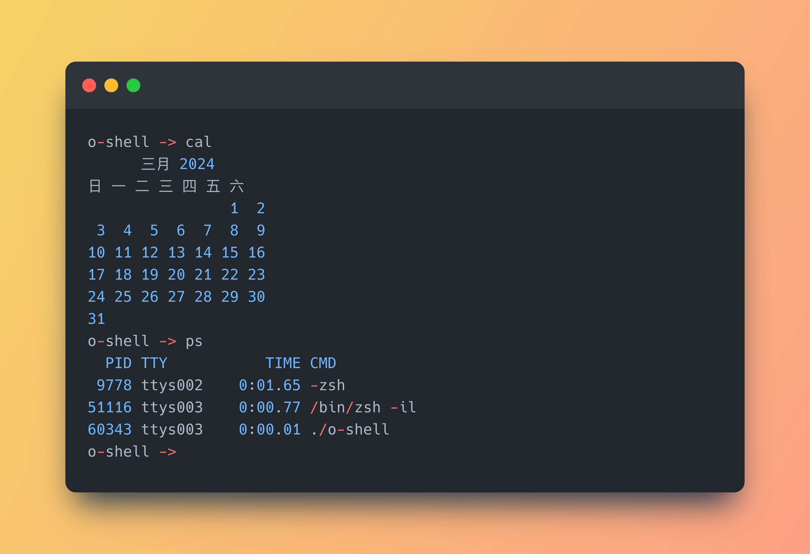
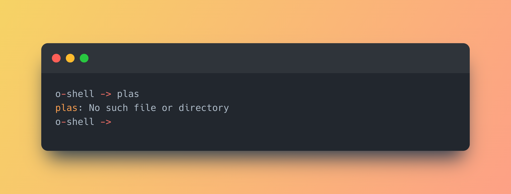
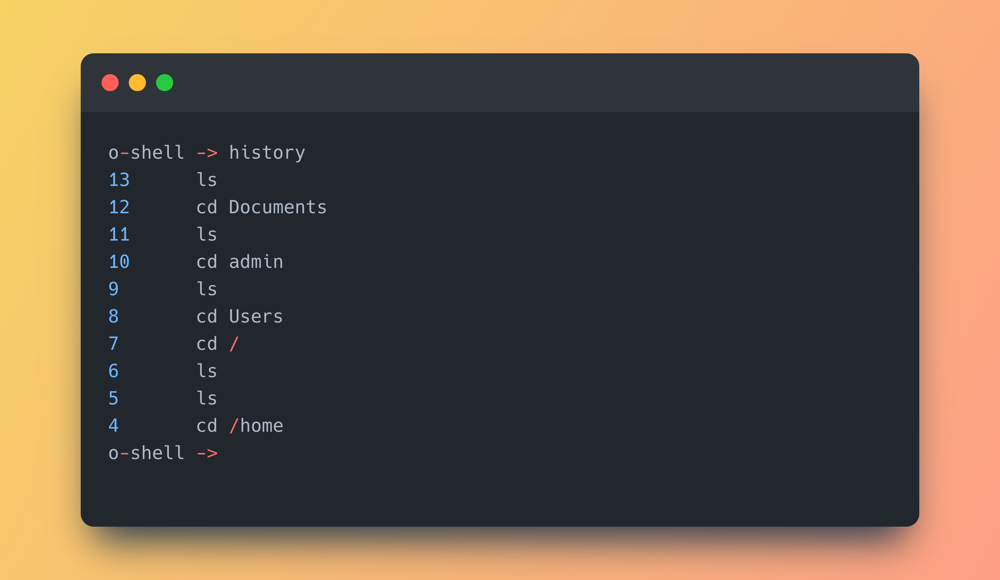
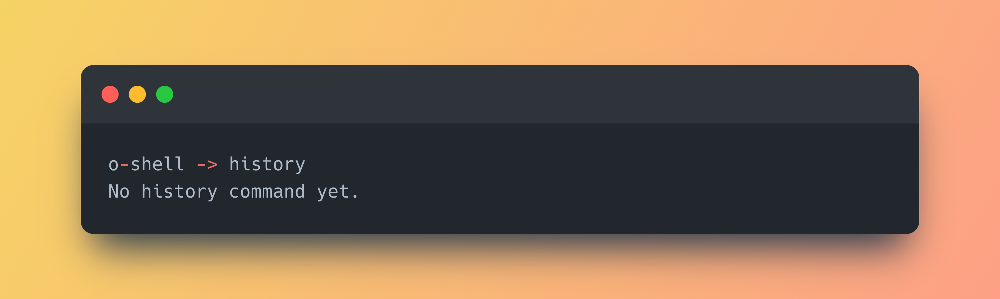
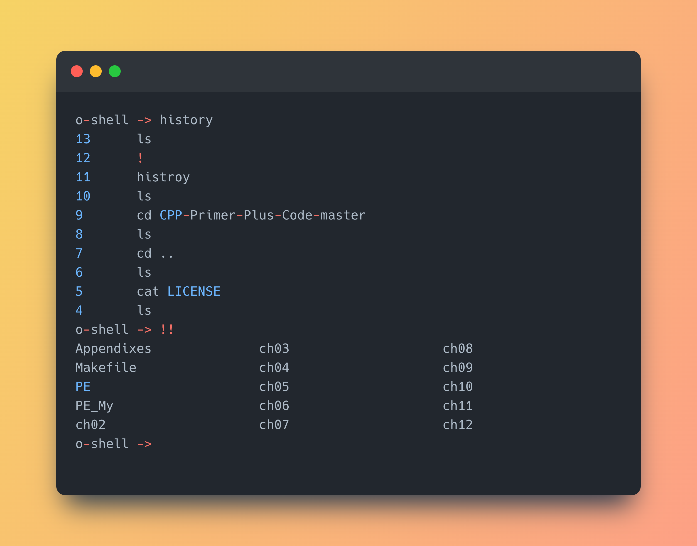
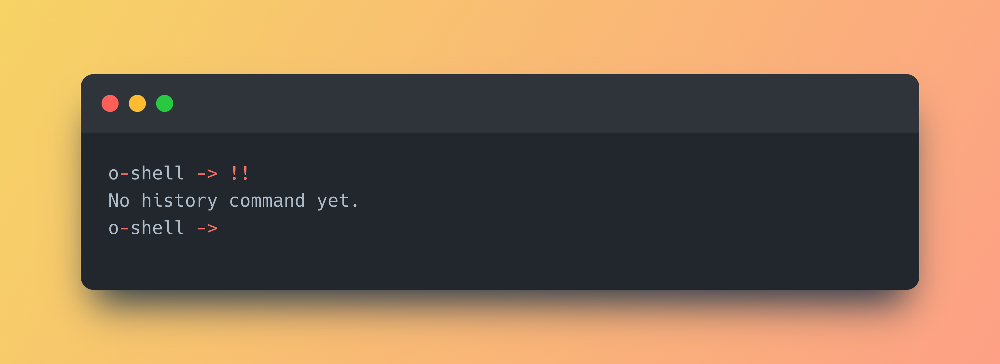
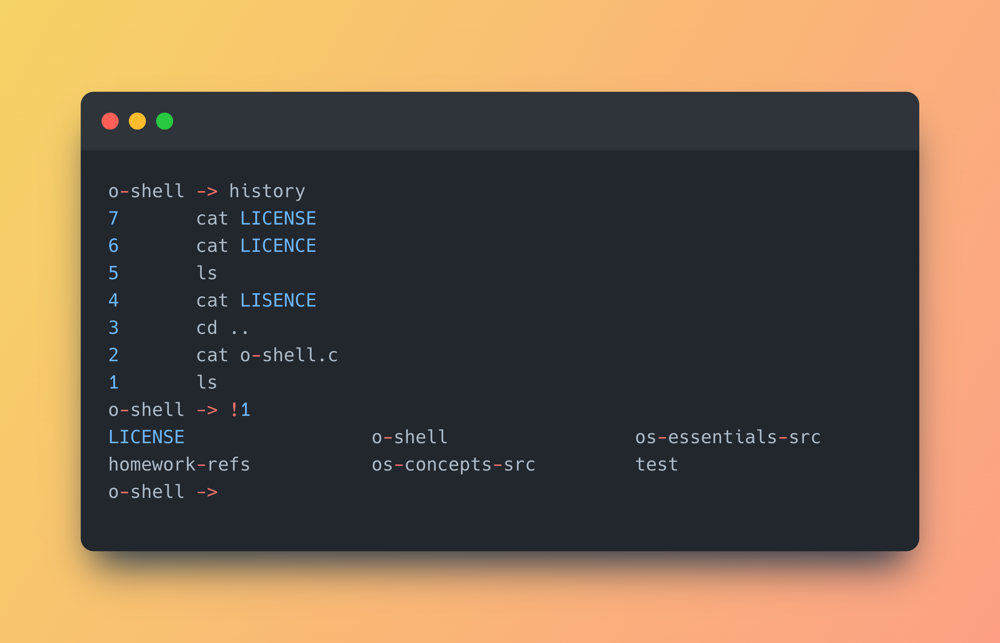
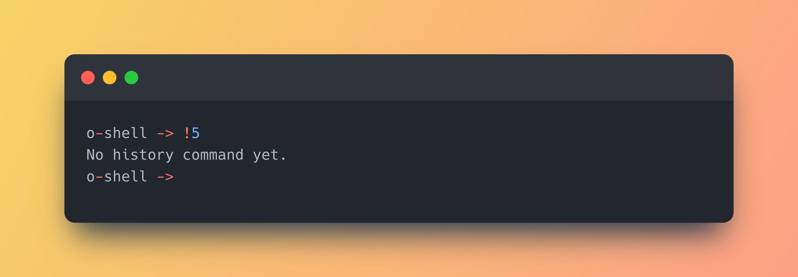
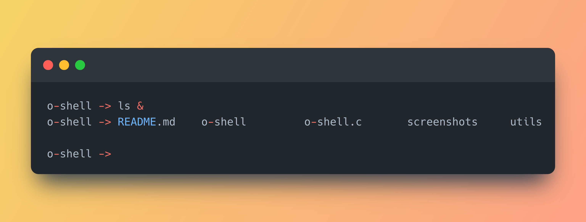
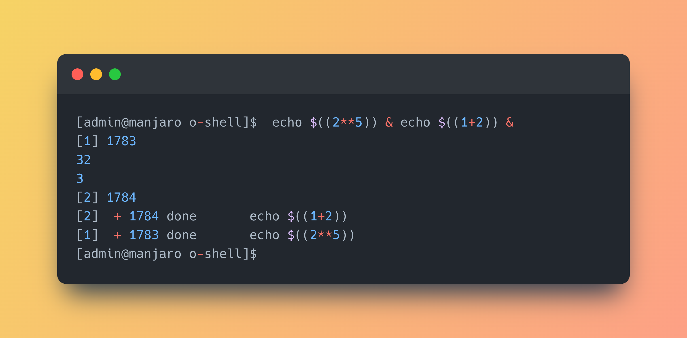

# O-shell - A Simple UNIX Shell

O-shell is a shell that performs basic functions of a UNIX shell (e.g. [bash](https://www.gnu.org/software/bash/), [zsh](https://www.zsh.org/))

There are several built-in commands supported and O-shell also supports commands that are already in operating system path.

## Installation

### Prerequisites

Your operating system must be GNU/Linux, UNIX, macOS or other POSIX compatible OSs.

### Compile

If you are using GNU/Linux, UNIX or macOS, there are no more compile flags needed because all headers in the source code are included in the path by default by the operating system and compilers.

Open system terminal in the folder, then run:

```bash
gcc o-shell.c -o o-shell && chmod +x o-shell
```

### Run 

You can run O-shell in system terminal directly:

```bash
./o-shell
```

If the program runs normally, it shows the prompt  `o-shell -> `.


## Features

### Run system executables

As long as the command/executable can be found by system, the O-shell can fork a new child process and execute it.



If the execution is not successful, the O-shell will print the reason for the error occurred.



### Built-in commands

#### `pwd`

This command shows the current working directory using system call `getcwd()`.

When executing this command, O-shell prints the working directory in the terminal.


#### `cd`

This command changes the current working directory using system call `chdir()`.

When executing this command, O-shell changes the working directory. If the given directory is not found, O-shell will print the error using `perror()`.

This command can be combined with `pwd` and `ls` to access the whole file system.


#### `exit`

This command terminates the O-shell process.


#### `history`

This command shows the most recent history.

When executing this command, O-shell shows recent command in decending order, from the most recent to the last recent. Each history command has a index, representing the index from the first command. The `history` command supports most 10 history commands. When there are more than 10 history commands, O-shell will forget the least recent history while memorizing the most recent history.



 When there is no history command, O-shell prints  `No history command yet.` .



#### `!!`

This command executes the most recent command.



If no recent command is found, O-shell prints  `No history command yet.` .



#### `![index]`

This command execute the recent command depending on the the index value.



If the command index is not found, the O-shell prints `No history command yet.` .



### Run without waiting

Enter any command following with `'&'`, the O-shell will not wait for the child process to complete.



This will result in format error because the O-shell tends to print the next prompt before the completion of the child process.

The solution of `zsh` or `bash` is to fork few child process(es), the shell waits for all child process(es) to complete, and each child process creates a new child process on its own based on the command. This prevents the format error and thus more safe.



## References

- Textbook (Operating System Concepts 9th Edition)

- [Get current working directory](https://stackoverflow.com/questions/16285623/how-to-get-the-path-to-the-current-file-pwd-in-linux-from-c)

- [Tokenize a string in C](https://stackoverflow.com/questions/266357/tokenizing-strings-in-c) (and a [Safer Version](https://stackoverflow.com/questions/26597977/split-string-with-multiple-delimiters-using-strtok-in-c))

- [Determine whether a string contains space only](https://stackoverflow.com/questions/3981510/getline-check-if-line-is-whitespace)

- [The return code of `execvp()`](https://linux.die.net/man/3/execvp)

- [GitHub@lnhutnam/simple-shell](https://github.com/lnhutnam/simple-shell)

- [Writing a Unix Shell - Part I](https://indradhanush.github.io/blog/writing-a-unix-shell-part-1/)
- [Writing a Unix Shell - Part II](https://indradhanush.github.io/blog/writing-a-unix-shell-part-2/)
