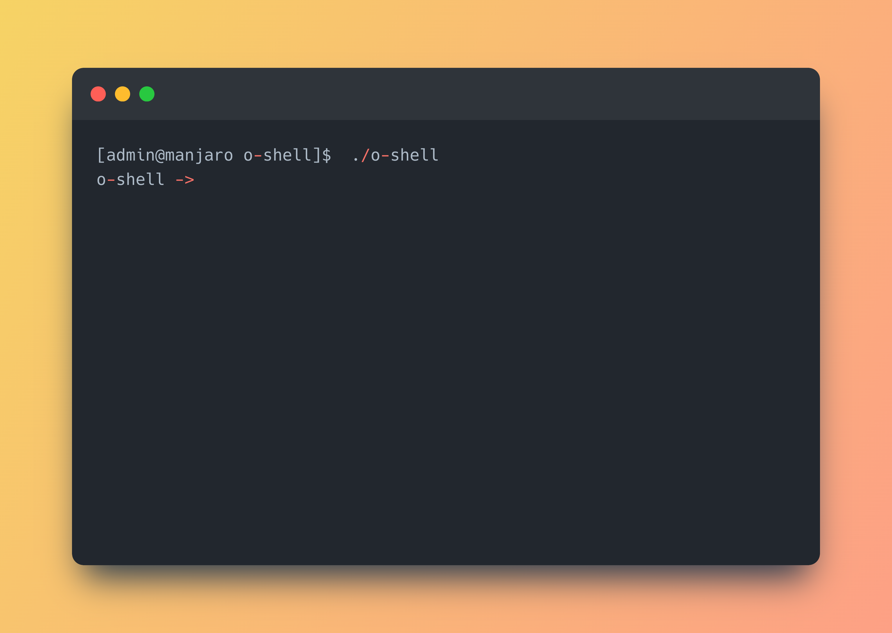
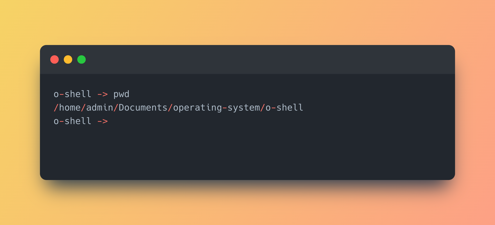
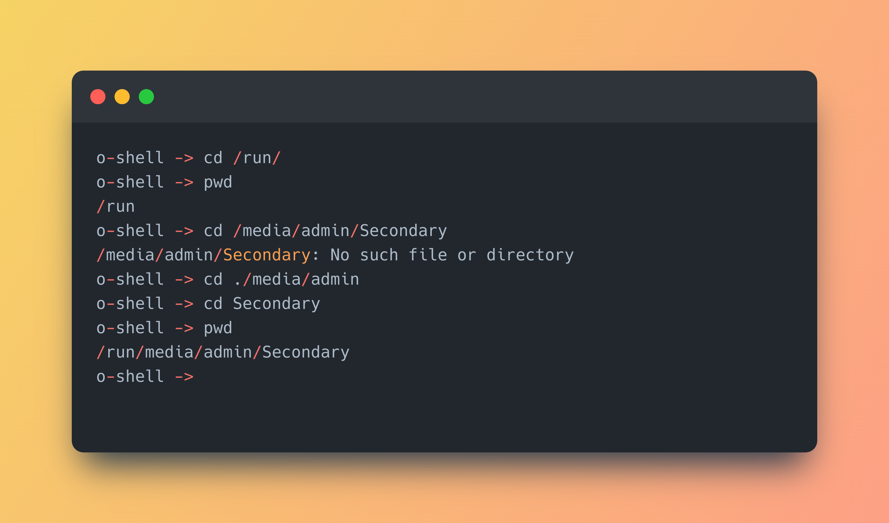
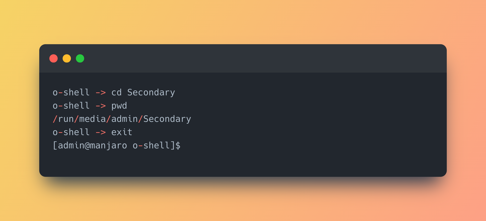

# O-shell - A Simple UNIX Shell

O-shell is a shell that performs basic functions of a UNIX shell (e.g. [bash](https://www.gnu.org/software/bash/), [zsh](https://www.zsh.org/))

There are several built-in commands supported and O-shell also supports commands that are already in operating system path.

## Installation

### Prerequisites

Your operating system must be GNU/Linux, UNIX or macOS, in other operating systems this program may work but this is not tested yet.

### Compile

If you are using GNU/Linux, UNIX or macOS, there are no more compile flags needed because all headers in the source code are included in the path by default by the operating system and compilers.

Open system terminal in the folder, then run:

```bash
gcc o-shell.c -o o-shell && chmod +x o-shell
```

### Run 

You can run O-shell in system terminal directly:

```bash
./o-shell
```

If the program runs normally, it shows the prompt  `o-shell -> `.



## Features

### Built-in commands

#### `pwd`

This command shows the current working directory using system call `getcwd()`.

When executing this command, O-shell prints the working directory in the terminal.



#### `cd`

This command changes the current working directory using system call `chdir()`.

When executing this command, O-shell changes the working directory. If the given directory is not found, O-shell will print the error using `perror()`.

This command can be combined with `pwd` and `ls` to access the whole file system.



#### `exit`

This command terminates the O-shell process.



## References

Click URL to see my references from Internet.

- Textbook (Operating System Concepts 9th Edition)

- [Get current working directory](https://stackoverflow.com/questions/16285623/how-to-get-the-path-to-the-current-file-pwd-in-linux-from-c)

- [Tokenize a string in C](https://stackoverflow.com/questions/266357/tokenizing-strings-in-c) (and a [Safer Version](https://stackoverflow.com/questions/26597977/split-string-with-multiple-delimiters-using-strtok-in-c))

- [Determine whether a string contains space only](https://stackoverflow.com/questions/3981510/getline-check-if-line-is-whitespace)

- [The return code of `execvp()`](https://linux.die.net/man/3/execvp)

- [GitHub@lnhutnam/simple-shell](https://github.com/lnhutnam/simple-shell)

- [Writing a Unix Shell - Part I](https://indradhanush.github.io/blog/writing-a-unix-shell-part-1/)
- [Writing a Unix Shell - Part II](https://indradhanush.github.io/blog/writing-a-unix-shell-part-2/)
